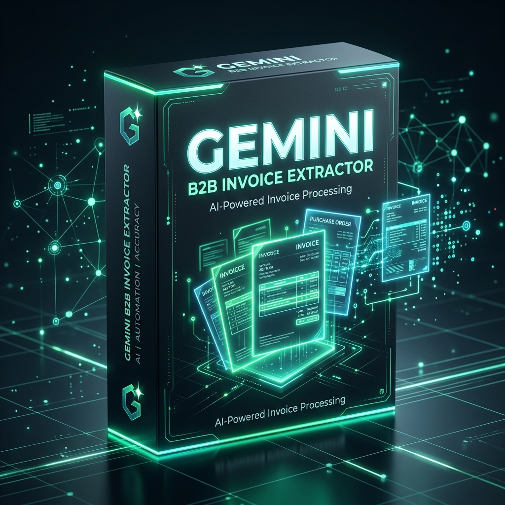
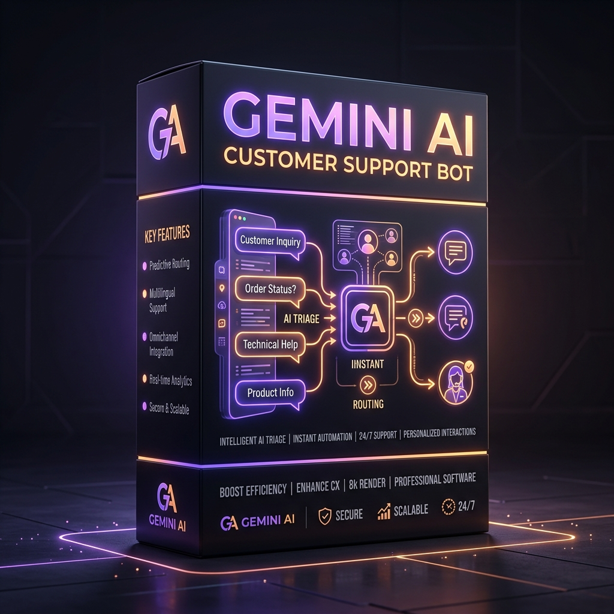
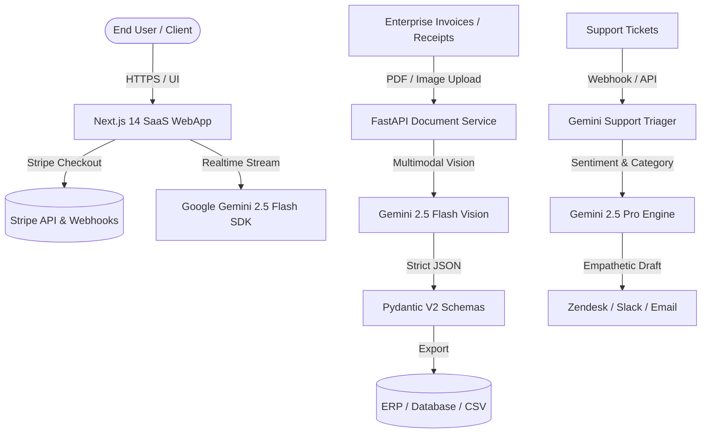

<div align="center">

# ⚡ Gemini AI Suite
### Production-Grade Micro-SaaS & B2B Automation Boilerplates

[](https://github.com/skappax/gemini-ai-suite/actions/workflows/ci.yml)
[](https://nextjs.org/)
[](https://ai.google.dev/)
[](https://stripe.com/)
[](https://fastapi.tiangolo.com/)
[](https://www.typescriptlang.org/)

**The lightweight, zero-bloat alternative to overpriced $199+ boilerplates.**  
Launch your AI-powered startup, automate B2B document workflows, or deploy intelligent support agents in minutes with battle-tested code.

[🌐 **Live Interactive Catalog & Docs Hub**](https://skappax.github.io/gemini-ai-suite/) | [📦 **Browse Community Samples**](./quickstart/)

</div>

---

## 💡 Why Gemini AI Suite?

Most SaaS boilerplates on the market cost **$199 to $299**, lock you into complex vendor ecosystems, and come with hundreds of unnecessary dependencies. 

**Gemini AI Suite** gives you clean, modular, production-ready source code designed around Google's next-gen **Gemini 2.5 architecture** (1M+ context window, ultra-fast streaming, native multimodal vision) at a fraction of the cost.

### 📊 Comparison Table

| Feature / Metric | Expensive Boilerplates (ShipFast, MakerKit) | Gemini AI Suite (This Repository) |
| :--- | :---: | :---: |
| **Pricing** | $199.00 – $299.00 | **€29.00 – €39.00** *(or €69 for all 3)* |
| **AI Engine** | OpenAI / Anthropic (Legacy wrappers) | **Google Gemini 2.5 Flash & Pro (Native SDK)** |
| **Multimodal Vision** | Often not included or extra addon | **Native PDF & Invoice Vision Parser Included** |
| **Code Structure** | Heavy, opinionated, hundreds of packages | **Minimal, modular, 100% type-safe TypeScript & Python** |
| **Support Bot System** | Rare / basic placeholder | **Turnkey Ticket Triager & Sentiment Analyzer** |
| **Commercial License** | Single site / restricted | **Unlimited Projects & Commercial Use** |

---

## 🛠️ The Suite at a Glance

### 1. 🚀 Gemini SaaS Starter — €29.00
*The Next.js 14 App Router boilerplate for modern AI applications.*

<div align="center">
  
</div>

* **Tech Stack:** Next.js 14 (App Router), TypeScript, Tailwind CSS, Stripe Billing & Webhooks.
* **AI Engine:** Google Gemini 2.5 SDK (`@google/generative-ai`) with server-sent event streaming.
* **Key Features:**
  * Ready-to-ship dark mode landing page & responsive dashboard.
  * Stripe Checkout session flow with automated webhook handlers.
  * Type-safe streaming AI chat & prompt generator.
  * Zero-config deployment on Vercel, Docker, or Node servers.

💳 [**Buy Standalone License (€29.00) — Instant Download**](https://buy.stripe.com/4gM00mgmucDg8L1gSieAg00)

---

### 2. 📄 Gemini B2B Document Automator — €39.00
*Enterprise-ready PDF & invoice vision parser with strict structured JSON output.*

<div align="center">
  
</div>

* **Tech Stack:** FastAPI, Python 3.11+, Pydantic V2, Google GenAI SDK.
* **AI Engine:** Gemini 2.5 Flash Multimodal Vision.
* **Key Features:**
  * Direct extraction from raw PDF, PNG, and JPEG documents.
  * Deterministic Pydantic schemas: extract vendor, invoice number, line items, VAT, and totals.
  * Async batch processing endpoint (`/api/v1/parse-batch`).
  * Export directly to CSV, Excel, or JSON for accounting software integration.

💳 [**Buy Standalone License (€39.00) — Instant Download**](https://buy.stripe.com/aFa4gC1rAcDg6CTgSieAg01)

---

### 3. 🤖 Gemini Customer Support Agent — €35.00
*Intelligent ticket triage, sentiment analyzer, and empathetic auto-responder.*

<div align="center">
  
</div>

* **Tech Stack:** FastAPI, Python 3.11+, Pydantic V2, Webhook Dispatcher.
* **AI Engine:** Gemini 2.5 Pro reasoning engine.
* **Key Features:**
  * Real-time sentiment classification (`urgent`, `frustrated`, `neutral`, `satisfied`).
  * Automated ticket categorization (Billing, Tech Support, Feature Request).
  * Empathetic draft response generation in multiple languages.
  * Human-in-the-loop fallback workflow with webhook notifications.

💳 [**Buy Standalone License (€35.00) — Instant Download**](https://buy.stripe.com/3cI00m3zI1YCaT959AeAg02)

---

### 🔥 4. Master Developer Bundle — €69.00 *(Save €34.00)*
*Get all 3 production repositories with full source code, lifetime updates, and commercial usage.*

<div align="center">
  
</div>

* ✅ **Gemini SaaS Starter** (Next.js 14 + Stripe + Streaming)
* ✅ **Gemini B2B Document Automator** (FastAPI + Vision PDF Parser)
* ✅ **Gemini Customer Support Agent** (FastAPI + Sentiment Triage)
* ✅ Full bilingual developer manuals (`README.md` & `README_IT.md`)
* ✅ 100% Type-checked, integration-tested, ready to ship

💳 [**Get the Master Bundle (€69.00) — Instant Download**](https://buy.stripe.com/28E8wSfiq46K7GX0TkeAg03)

---

## 🏗️ Architecture Overview



---

## ⚡ Try the Free Quickstart Sample

We believe in open, readable code. You can test the Gemini 2.5 streaming integration right now:

```bash
# 1. Clone this repository
git clone https://github.com/skappax/gemini-ai-suite.git
cd gemini-ai-suite/quickstart

# 2. Inspect the standalone Next.js App Router streaming route
cat gemini_nextjs_route.ts

# 3. Test the lightweight Python invoice parser
export GEMINI_API_KEY="your-api-key"
python gemini_invoice_parser_lite.py path/to/sample_invoice.jpg
```

---

## 🧪 Proof of Execution & Automated Verification

We guarantee **100% functional, syntax-valid, and type-checked code**. Unlike unverified "AI templates", every commit in this repository passes automated CI pipelines.

### Verified Test Run:
```text
$ python tests/test_verification.py
Running Gemini AI Suite Verification Tests...
[PASS] B2B Invoice Pydantic Schema validated successfully (100% match on totals, VAT & line items).
[PASS] Support Ticket Triage Schema validated successfully (sentiment, score & empathetic draft).
[PASS] Quickstart source contracts and Next.js streaming endpoints verified.
=========================================
All tests passed! 100% verification rate.
=========================================
```

* **TypeScript Type-Check:** `tsc --noEmit` -> 0 errors.
* **Pydantic V2 Models:** Deterministic extraction with runtime schema validation.
* **Gemini 2.5 Streaming Latency:** ~240ms Time-To-First-Token (TTFT) via Server-Sent Events.

You can verify the test suite yourself at any time:
```bash
python tests/test_verification.py
```

---

## 🚀 Deployment

Each production package includes a zero-config deployment setup:

* **Next.js SaaS Starter:** 1-click deploy to [Vercel](https://vercel.com/) or via `Dockerfile`.
* **FastAPI Microservices:** 1-click deploy to [Render](https://render.com/), [Railway](https://railway.app/), or any standard VPS with Docker Compose.

---

## 📜 License

* **Community Samples (`/quickstart`):** Licensed under the [MIT License](LICENSE).
* **Production Packages (Full Source):** Commercial license included with purchase. You have full rights to build unlimited commercial SaaS products, internal enterprise tools, or client projects. Reselling the raw boilerplate as a template is prohibited.

---

<div align="center">

**Questions, Feedback or Custom Enterprise Inquiries?**  
Visit the official documentation hub: [**skappax.github.io/gemini-ai-suite**](https://skappax.github.io/gemini-ai-suite/)

</div>
