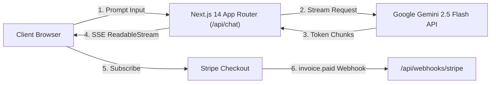

# How to Build a Production-Ready AI SaaS with Next.js 14, Google Gemini 2.5 Streaming & Stripe

Building an AI SaaS in 2026 is no longer about just calling an LLM endpoint and waiting 10 seconds for a response. Modern users expect:
1. **Sub-second Time-to-First-Token (TTFT)** via Server-Sent Events (SSE).
2. **Predictable margins** without getting crushed by high per-token pricing.
3. **Rock-solid Stripe billing** with webhook-driven entitlement verification.

In this tutorial, we will build a complete end-to-end AI SaaS architecture using **Next.js 14 App Router**, the **Google Gemini 2.5 Flash API**, and **Stripe Checkout & Webhooks**.

---

## Architecture Overview



### Why Google Gemini 2.5 Flash?
- **Speed**: Gemini 2.5 Flash offers the lowest latency among frontier models (~200ms TTFT).
- **Cost Efficiency**: At **$0.075 / 1M input tokens**, it is roughly **33x cheaper** than GPT-4o ($2.50 / 1M), making SaaS gross margins exceed 90%.
- **Massive Context**: 1M+ tokens allows full-document and multi-file analysis in a single prompt.

---

## 1. Setting Up the Streaming Route Handler

Create `app/api/chat/route.ts`. We leverage Next.js App Router's Edge runtime or Node.js streaming with `TransformStream`.

```typescript
import { GoogleGenerativeAI } from '@google/generative-ai';
import { NextRequest, NextResponse } from 'next/server';

const genAI = new GoogleGenerativeAI(process.env.GEMINI_API_KEY || '');

export async function POST(req: NextRequest) {
  try {
    const { prompt, systemInstruction } = await req.json();

    if (!prompt) {
      return NextResponse.json({ error: 'Prompt is required' }, { status: 400 });
    }

    const model = genAI.getGenerativeModel({
      model: 'gemini-2.5-flash',
      systemInstruction: systemInstruction || 'You are an expert full-stack developer assistant.',
    });

    const result = await model.generateContentStream(prompt);

    // Create a streaming response
    const encoder = new TextEncoder();
    const stream = new ReadableStream({
      async start(controller) {
        for await (const chunk of result.stream) {
          const text = chunk.text();
          controller.enqueue(encoder.encode(text));
        }
        controller.close();
      },
    });

    return new Response(stream, {
      headers: {
        'Content-Type': 'text/plain; charset=utf-8',
        'Transfer-Encoding': 'chunked',
        'Cache-Control': 'no-cache, no-transform',
      },
    });
  } catch (error: any) {
    console.error('Gemini Streaming Error:', error);
    return NextResponse.json({ error: error.message || 'Internal Server Error' }, { status: 500 });
  }
}
```

---

## 2. Consuming the Stream in React (Next.js Client Component)

In your client component (`components/ChatInterface.tsx`), consume the `ReadableStream` chunk by chunk for real-time typewriter rendering:

```tsx
'use client';

import { useState } from 'react';

export default function ChatInterface() {
  const [input, setInput] = useState('');
  const [response, setResponse] = useState('');
  const [loading, setLoading] = useState(false);

  const handleSubmit = async (e: React.FormEvent) => {
    e.preventDefault();
    if (!input.trim() || loading) return;

    setLoading(true);
    setResponse('');

    try {
      const res = await fetch('/api/chat', {
        method: 'POST',
        headers: { 'Content-Type': 'application/json' },
        body: JSON.stringify({ prompt: input }),
      });

      if (!res.ok) throw new Error(await res.text());

      const reader = res.body?.getReader();
      const decoder = new TextDecoder();

      if (!reader) return;

      while (true) {
        const { done, value } = await reader.read();
        if (done) break;
        const chunk = decoder.decode(value, { stream: true });
        setResponse((prev) => prev + chunk);
      }
    } catch (err: any) {
      setResponse(`Error: ${err.message}`);
    } finally {
      setLoading(false);
    }
  };

  return (
    <div className="max-w-2xl mx-auto p-6 space-y-4">
      <form onSubmit={handleSubmit} className="flex gap-2">
        <input
          value={input}
          onChange={(e) => setInput(e.target.value)}
          placeholder="Ask anything..."
          className="flex-1 border rounded-lg px-4 py-2 text-black"
        />
        <button
          type="submit"
          disabled={loading}
          className="bg-blue-600 text-white px-6 py-2 rounded-lg font-medium hover:bg-blue-700 disabled:opacity-50"
        >
          {loading ? 'Streaming...' : 'Send'}
        </button>
      </form>

      {response && (
        <div className="p-4 bg-gray-900 text-gray-100 rounded-lg whitespace-pre-wrap font-mono text-sm leading-relaxed">
          {response}
        </div>
      )}
    </div>
  );
}
```

---

## 3. Stripe Subscription Checkout Route

To monetize, create a checkout session endpoint at `app/api/checkout/route.ts`:

```typescript
import { NextRequest, NextResponse } from 'next/server';
import Stripe from 'stripe';

const stripe = new Stripe(process.env.STRIPE_SECRET_KEY!, {
  apiVersion: '2023-10-16',
});

export async function POST(req: NextRequest) {
  try {
    const { priceId, customerEmail } = await req.json();

    const session = await stripe.checkout.sessions.create({
      payment_method_types: ['card'],
      line_items: [{ price: priceId, quantity: 1 }],
      mode: 'subscription',
      customer_email: customerEmail,
      success_url: `${process.env.NEXT_PUBLIC_APP_URL}/dashboard?session_id={CHECKOUT_SESSION_ID}`,
      cancel_url: `${process.env.NEXT_PUBLIC_APP_URL}/pricing`,
    });

    return NextResponse.json({ url: session.url });
  } catch (error: any) {
    return NextResponse.json({ error: error.message }, { status: 500 });
  }
}
```

---

## 4. Verifying Webhooks for Automated Access Provisioning

Never trust client-side redirects for granting access. Handle Stripe's `checkout.session.completed` and `customer.subscription.deleted` in `app/api/webhooks/stripe/route.ts`:

```typescript
import { headers } from 'next/headers';
import { NextRequest, NextResponse } from 'next/server';
import Stripe from 'stripe';

const stripe = new Stripe(process.env.STRIPE_SECRET_KEY!, {
  apiVersion: '2023-10-16',
});

export async function POST(req: NextRequest) {
  const body = await req.text();
  const signature = headers().get('stripe-signature') as string;

  let event: Stripe.Event;

  try {
    event = stripe.webhooks.constructEvent(
      body,
      signature,
      process.env.STRIPE_WEBHOOK_SECRET!
    );
  } catch (err: any) {
    console.error(`Webhook signature verification failed: ${err.message}`);
    return new NextResponse(`Webhook Error: ${err.message}`, { status: 400 });
  }

  switch (event.type) {
    case 'checkout.session.completed': {
      const session = event.data.object as Stripe.Checkout.Session;
      console.log(`Payment confirmed for user: ${session.customer_email}`);
      // Grant subscription status in database (Prisma / Supabase)
      break;
    }
    case 'customer.subscription.deleted': {
      const subscription = event.data.object as Stripe.Subscription;
      console.log(`Subscription cancelled: ${subscription.id}`);
      // Revoke user access
      break;
    }
  }

  return NextResponse.json({ received: true });
}
```

---

## Summary & Full Starter Kit

With this stack:
- You get sub-second responses using **Gemini 2.5 Flash** streaming.
- You keep infrastructure costs near zero thanks to Google AI Studio's competitive token pricing and Next.js serverless functions.
- You have automated recurring revenue via **Stripe Billing**.

### Want the Complete Battle-Tested Codebase?

If you don't want to build auth, database schemas, rate-limiting, and UI templates from scratch, check out the **[Gemini AI Suite](https://github.com/skappax/gemini-ai-suite)**.

It includes:
- **`gemini-saas-starter`**: Complete Next.js 14 App Router boilerplate with Gemini 2.5 streaming, shadcn/ui components, and Stripe.
- **`gemini-b2b-automator`**: FastAPI high-throughput PDF/invoice extractor with Pydantic schemas.
- **`gemini-support-agent`**: Multi-agent customer support triage & auto-responder.

👉 **Repository:** [https://github.com/skappax/gemini-ai-suite](https://github.com/skappax/gemini-ai-suite)  
👉 **Live Demo & Early Bird Deal (39 € / 43% OFF):** [https://skappax.github.io/gemini-ai-suite/](https://skappax.github.io/gemini-ai-suite/)
